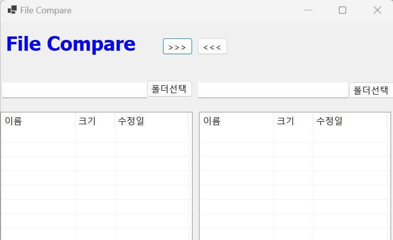
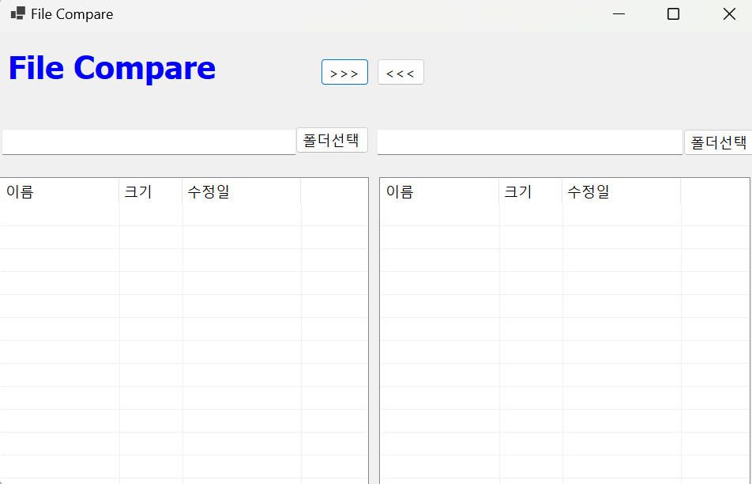
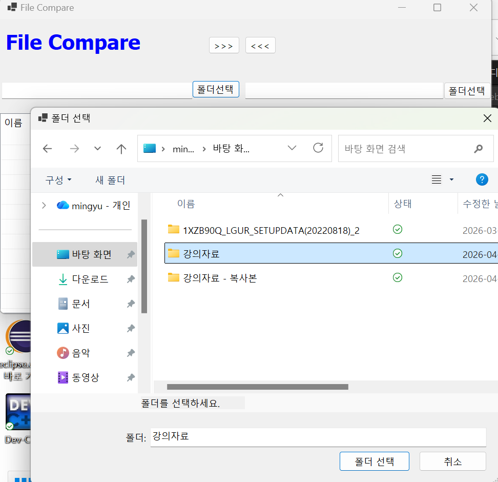
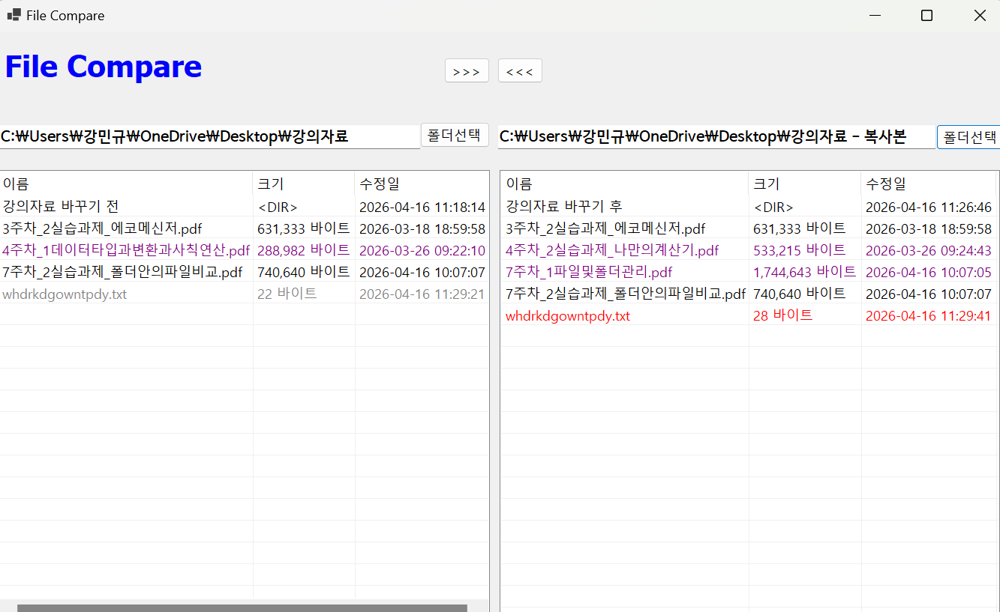
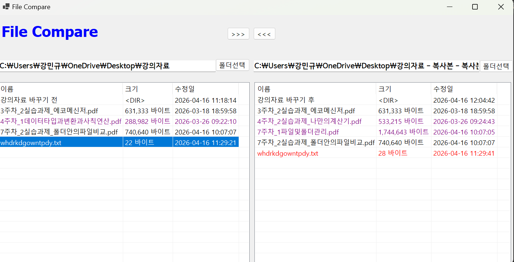
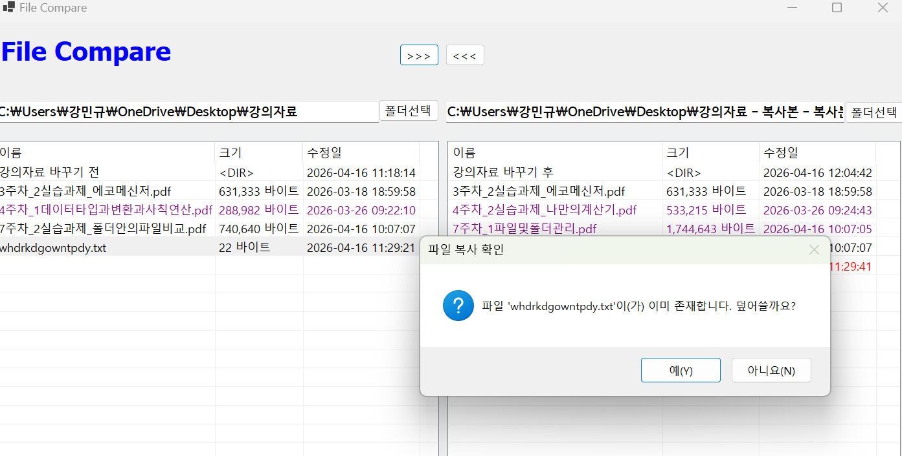
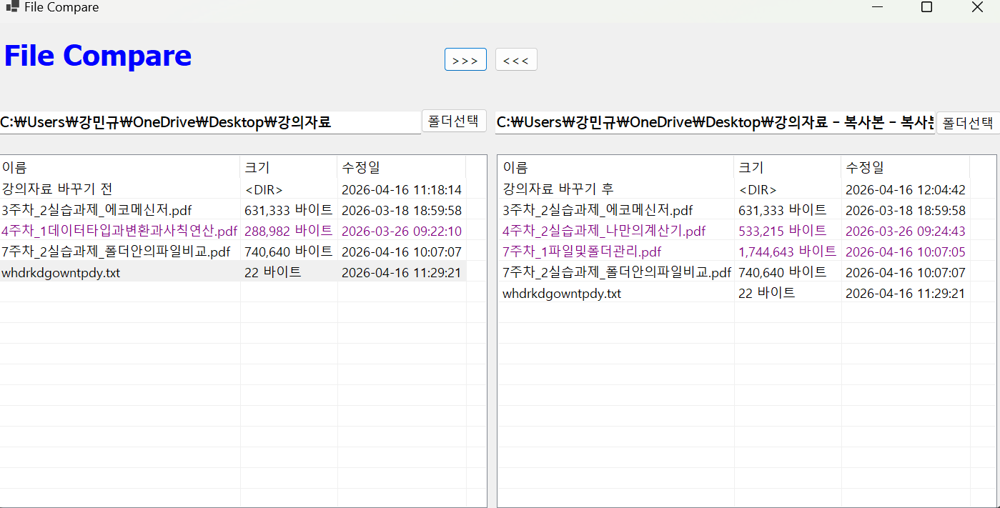
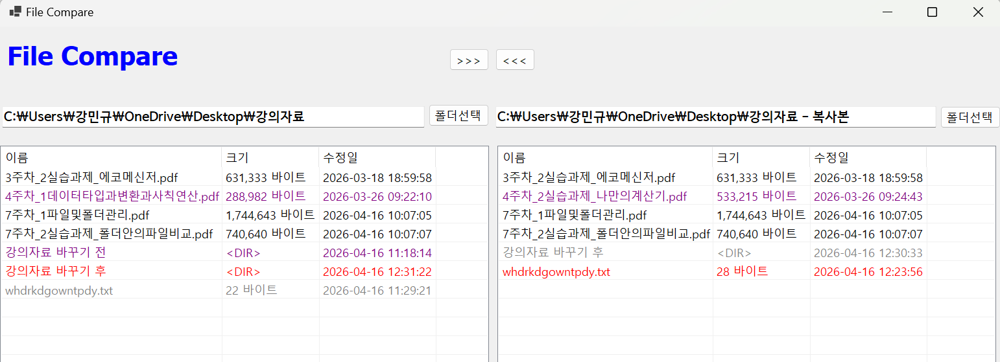
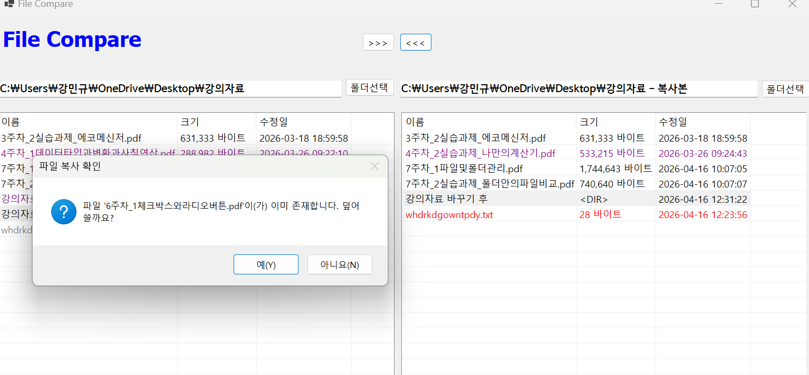
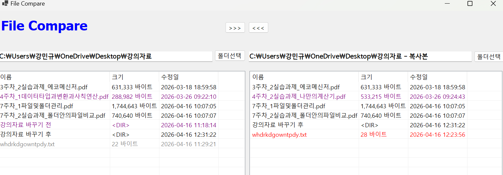

# (C# 코딩) 

## 개요
- C# 프로그래밍을 활용한 로컬 파일/폴더 관리 및 동기화 도구입니다.

### -1줄소개: 양방향 파일 비교 및 재귀적 동기화 기능을 제공하는 데스크톱 기반 파일 관리 시스템입니다.

### -사용한플랫폼: C#, .NET Windows Forms, Visual Studio, GitHub

### -사용한컨트롤:
 - 컨트롤: SplitContainer, Panel, ListView, Button, TextBox, FolderBrowserDialog, MessageBox
 - 속성: Dock, Anchor
 - 이벤트: Click

### -사용한기술과구현한기능: 

파일 시스템 입출력 (System.IO), LINQ를 이용한 정렬 및 필터링, 재귀 호출(Recursive)을 통한 폴더 동기화, 사용자 확인 기반 파일 덮어쓰기 로직.
 
### -수업중에배우고사용했던클래스들관련된설명

DirectoryInfo / FileInfo: 파일과 폴더의 이름, 크기, 수정 시간 등 메타데이터에 접근하는 클래스로 명시되어 있습니다. 

Directory: EnumerateFiles 및 EnumerateDirectories 메서드를 통해 폴더 내 항목을 스트리밍 방식으로 가져오는 효율적인 방법이 설명되어 있습니다. 

ListView: 데이터를 표(Grid) 형태로 표시하기 위한 컨트롤로, Details 뷰 설정 및 컬럼 추가 방법이 상세히 나와 있습니다. 

FolderBrowserDialog: 사용자가 폴더를 선택할 수 있게 해주는 대화상자 컨트롤로 소개되었습니다. 

### -실습중에구현한기능들설명

기본 기능 (과제 1): 폴더 선택 및 ListView를 이용한 파일 목록 표시 기능이 포함되어 있습니다. 

비교 기능 (과제 2): 파일 이름과 수정 시간을 기준으로 상태(동일, New, Old, 단독)를 판별하고, 이를 색상(빨강, 회색, 보라 등)으로 구분하는 로직이 설명되어 있습니다. 

관리 기능 (과제 3, 4):선택한 파일을 반대편으로 복사하는 기능이 있습니다. 이미 파일이 존재할 경우 **덮어쓰기 확인(Confirmation)**을 처리하는 과정이 명시되어 있습니다. 파일 복사 시 예외 상황을 방지하기 위한 try-catch 구문 활용법도 포함되어 있습니다.

## 실행화면(과제1)

### -과제1코드의실행스크린샷
 

### -과제내용

1.  Windows Forms 기초 UI 구성.

2. 폴더 경로를 선택하는 FolderBrowserDialog 활용.

3. 선택한 폴더 내 파일 및 폴더 목록을 ListView에 나열.

4. 파일의 속성(이름, 크기, 시간)을 컬럼으로 표시. 

### -구현내용과기능설명

1.  UI 컨트롤 배치 및 폼 디자인.

2. btnLeftDir_Click, btnRightDir_Click 이벤트 구현.

3. PopulateListView 함수를 통한 파일 목록 로딩.

4. 리스트 뷰 컬럼 자동 크기 조절 기능. 

### -사용한 기술과 구현한 기능

- AutoResizeColumn: 사용자 편의성을 위한 UI 동적 조정. 

## -실행화면(과제2)
### -과제2코드의실행스크린샷

### -과제내용

1.  두 폴더 간 파일 비교 알고리즘 구현.

2. 비교 결과에 따른 텍스트 색상 변경(비교 표시).

3. 최신 파일, 오래된 파일, 단독 파일 구분 로직.

4. 비교 후 가독성을 높이기 위한 UI 색상 적용. 

### -구현내용과기능설명

1. 양쪽 ListView 아이템을 순회하는 반복문 설계.

2. DateTime 파싱을 통한 파일 수정일 비교.

3. 상태별 색상 적용 (New: 빨강, Old: 회색, 단독: 보라).

4. CompareFiles 함수를 통한 목록 갱신 후 즉시 비교. 
 
### -사용한 기술과 구현한 기능

  - DateTime.TryParse: 데이터 형식 예외 처리.

 - ForeColor: 리스트 아이템의 시각적 상태 표시. 

## -실행화면(과제3)
### -과제3코드의실행스크린샷

### -과제내용

1.  파일 복사 기능 (>>>, <<<) 구현.

2. 복사 전 대상 파일 존재 확인.

3. 사용자에게 덮어쓰기 여부를 묻는 메시지 박스 출력.

4. 복사 후 파일 목록 새로고침. 

### -구현내용과기능설명

1.  딕셔너리를 활용한 파일 정보 객체 매핑.

2. CopyFileWithConfirmation 함수로 복사 로직 분리.

3. 메시지 박스 내 원본/대상 경로 표시 구현.

4. 복사 성공 시 PopulateListView 재호출.

### -사용한 기술과 구현한 기능

 - Dictionary: 빠른 데이터 접근.

 - File.Copy: 파일 복사 API 활용.

## -실행화면(과제4)

### -과제4코드의실행스크린샷

### -과제내용

1.  하위 폴더 재귀적 동기화 구현.

2. 폴더를 하나의 파일처럼 처리하는 다형성 적용.

3. 복사 시 수정일(LastWriteTime) 동기화 유지.

4. 복잡한 폴더 구조에 대한 안정적인 복사 처리.  

### -구현내용과기능설명

1.  FileSystemInfo를 사용하여 폴더와 파일 통합 관리.

2. CopyRecursiveAndConfirm 함수를 이용한 깊이 우선 탐색(DFS) 방식 복사.

3. 원본의 수정 시간을 대상 파일/폴더에 강제 동기화.

4. 하위 폴더 생성 및 항목 순회 복사.

### -사용한 기술과 구현한 기능

 - 재귀 호출 (Recursive Function): 폴더 구조 탐색.

 - 메타데이터 동기화: LastWriteTime 프로퍼티 활용.
